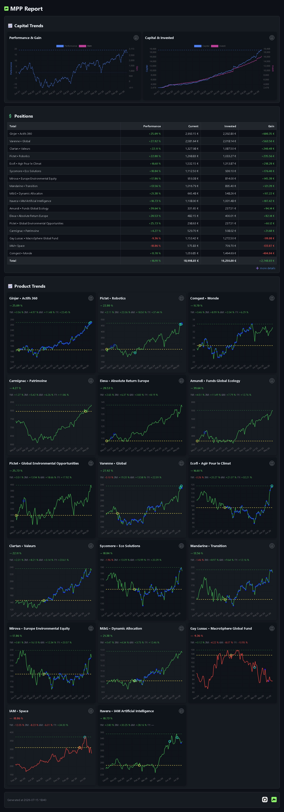

# MPP Tools

A collection of Python tools to extract data from [Mon Petit Placement](https://www.monpetitplacement.fr) and generate personal portfolio reports.



❤️ Made in France

## 🔒 Privacy Notice

- These scripts retrieve, process, and store portfolio data locally on your machine.
- No data is sent to or shared with any external service.
- All extracted data is stored locally in a SQLite database.


## 📝 Overview

**MPP Tools** consists of three main modules:

- **Data Extraction**: Retrieves and stores financial data from the MPP API
- **HTML Report Generation**: Generates an HTML report from the collected data
- **Markdown Report Generation**: Generates a Markdown report from the collected data

### 📁 Project Structure

```
mpp-tools/
├── src/
│   ├── build_html_report/
│   ├── build_md_report/
│   └── extract_data/
├── run.sh
└── setup.sh
```

## ⚙️ Prerequisites

- Python 3.10 or higher
- Nginx (for deployment)
- Certbot (for TLS certificates)

## 🚀 Installation

Clone the repository and run the `setup.sh` script:

```bash
git clone https://github.com/dhabierre/mpp-tools.git

cd mpp-tools

git fetch --tags
git tag
git checkout tags/1.0.0 # Replace 1.0.0 with the desired version
```

```bash
# Edit the `setup.sh` script
# Update the `BASE` variable to match your installation path

nano setup.sh

chmod +x setup.sh
./setup.sh

# Example output:
# 
# 🔎 === Setup started ===
# 
# 🏗️ === Setup extract_data ===
# 🐍 Creating virtual environment...
# ⚡ Activating virtual environment...
# 📦 Checking dependencies...
# ✅ extract_data setup completed.
# 
# 🏗️ === Setup build_html_report ===
# 🐍 Creating virtual environment...
# ⚡ Activating virtual environment...
# 📦 Checking dependencies...
# ✅ build_html_report setup completed.
# 
# 🏗️ === Setup build_md_report ===
# 🐍 Creating virtual environment...
# ⚡ Activating virtual environment...
# 📦 Checking dependencies...
# ✅ build_md_report setup completed.
# 
# 🔐 Checking permissions...
# ✅ Added execute permission to run.sh
# 
# 🎉 === Installation completed successfully ===
```

Configure each module by creating its `.env` file:

```bash
# 1. Data Extraction
# Create the `.env` file and configure API credentials and storage paths

cp src/extract_data/.env.sample src/extract_data/.env
nano src/extract_data/.env

# 2. HTML Report Generation
# Create the `.env` file and configure report generation options

cp src/build_html_report/.env.sample src/build_html_report/.env
nano src/build_html_report/.env

# 2. Markdown Generation
# Create the `.env` file and configure report generation options

cp src/build_md_report/.env.sample src/build_md_report/.env
nano src/build_md_report/.env
```

## ▶️ Usage

### 🖥️ Manual Execution

```bash
BASE="/home/ubuntu/mpp-tools" # Change to your installation path

"$BASE/src/extract_data/venv/bin/python" "$BASE/src/extract_data/main.py"

# Example output:
#
# 2026-07-10 21:29:01,668 | INFO | 🔄 [1 /6] Extracting 'Capital' data...
# 2026-07-10 21:29:01,686 | INFO | ✅ [1 /6] Data 'Capital' extracted.
# 2026-07-10 21:29:01,686 | INFO | 🔄 [2 /6] Extracting 'Capital Trends' data...
# 2026-07-10 21:29:01,722 | INFO | ✅ [2 /6] Data 'Capital Trends' extracted (1507).
# 2026-07-10 21:29:01,723 | INFO | 🔄 [3 /6] Extracting 'Products' data...
# 2026-07-10 21:29:01,850 | INFO | ✅ [3 /6] Data 'Products' extracted (56).
# 2026-07-10 21:29:01,850 | INFO | 🔄 [4 /6] Extracting 'Positions' data...
# 2026-07-10 21:29:02,232 | INFO | ✅ [4 /6] Data 'Positions' extracted (17).
# 2026-07-10 21:29:02,232 | INFO | 🔄 [5 /6] Extracting 'Product Trends' data...
# 2026-07-10 21:29:25,076 | INFO | ✅ [5 /6] Data 'Product Trends' extracted (53233).
# 2026-07-10 21:29:25,076 | INFO | 🔄 [6 /6] Extracting 'Invest Orders' data...
# 2026-07-10 21:29:26,418 | INFO | ✅ [6 /6] Data 'Invest Orders' extracted (589).
# 2026-07-10 21:29:28,255 | INFO | 🏁 Data stored (db: /home/ubuntu/mpp-tools/src/extract_data/mpp.sqlite3)

"$BASE/src/build_html_report/venv/bin/python" "$BASE/src/build_html_report/main.py"

# Example output:
# 
# 2026-07-10 21:31:43,918 | INFO | 🔄 Building HTML report...
# 2026-07-10 21:31:44,143 | INFO | ✅ Report written (path: /home/ubuntu/mpp-tools/outputs/reports/report.html)

"$BASE/src/build_md_report/venv/bin/python" "$BASE/src/build_md_report/main.py"

# Example output:
# 
# 2026-07-10 21:32:09,312 | INFO | 🔄 Building MD report...
# 2026-07-10 21:32:09,677 | INFO | ✅ Report written (path: /home/ubuntu/mpp-tools/outputs/reports/report.md)
```

### ⏰ Scheduled Execution

This step allows you to automate script execution.

```bash
# Edit the `run.sh` script and adjust the `BASE` variable
nano run.sh
```

Run the script to validate the setup (`.env` files, paths, etc.):

```bash
chmod +x run.sh
./run.sh
ls -al logs
```

To set up the cron job:

```bash
crontab -e

# Add the following line:
# 0 10,14,20 * * * /home/ubuntu/mpp-tools/run.sh
```

## 🌐 Deployment [Optional]

### 🖥️ Server Preparation

```bash
# Create the web directory

sudo mkdir -p /var/www/mpp
sudo chown -R www-data:www-data /var/www/mpp

# Set `REPORT_PATH` to /var/www/mpp/report.html
nano src/build_html_report/.env

# Set `REPORT_PATH` to /var/www/mpp/report.md
nano src/build_md_report/.env
```

### ⚡ Nginx Configuration

Create the Nginx configuration file:

```bash
sudo nano /etc/nginx/sites-available/mpp
```

Add the following configuration:

```nginx
server {
    listen 80;
    listen [::]:80;
    server_name mpp.yourdns.org;
    root /var/www/mpp;
}
```

Enable the site:

```bash
sudo ln -s /etc/nginx/sites-available/mpp /etc/nginx/sites-enabled/
sudo nginx -t
sudo systemctl reload nginx
```

### 🔒 TLS Certificate with Certbot

```bash
sudo certbot --nginx
```

### 🚀 TLS and HTTP/2 Configuration

Edit the Nginx configuration again:

```bash
sudo nano /etc/nginx/sites-available/mpp
```

Enable HTTP/2:

```nginx
server {
    listen 443 ssl;
    listen [::]:443 ssl;
    http2 on;
    # ...
}
```

Apply the changes:

```bash
sudo nginx -t
sudo systemctl reload nginx
```

### 👤 User Permissions

```bash
sudo usermod -aG www-data ubuntu
sudo chmod 775 /var/www/mpp
newgrp www-data
```

## ⚖️ License

MIT — see [LICENSE](LICENSE).
